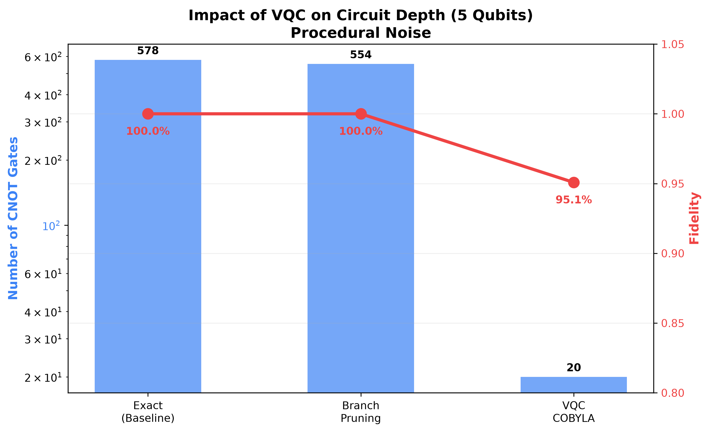
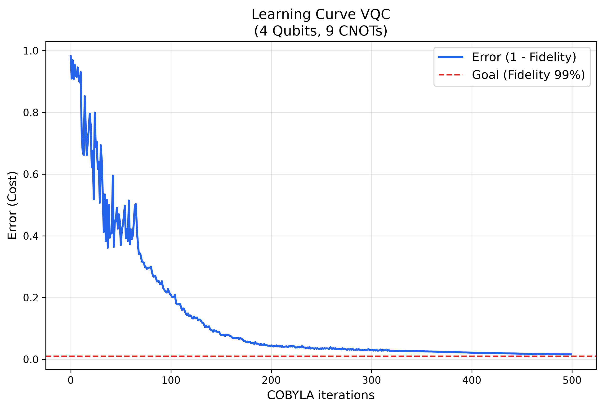

# 🌊 q-state-prep: Hardware-Efficient State Preparation for Procedural Noise

An advanced quantum state preparation library exploring the transition from exact mathematical initialization (Grover-Rudolph) to hardware-efficient Variational Quantum Circuits (VQC). 

This project tackles the exponential depth bottleneck $O(2^n)$ in NISQ devices, specifically applying these algorithms to generate **1D procedural visual noise maps** for multimedia and game engine environments.

## 🎯 The Problem
Procedural generation (like Perlin or Simplex noise) relies on complex probability distributions. Initializing these distributions into a quantum state using traditional analytical methods requires multi-controlled rotations, leading to an explosion of CNOT gates. On current NISQ hardware, this circuit depth translates directly to decoherence and white noise.

## 🚀 Architecture & Solutions
This library implements and benchmarks three approaches to solve the initialization bottleneck:

1. **Baseline Exact Preparation:** A recursive, top-down tree approach computing precise $Ry$ angles. Yields 100% mathematical fidelity but is unviable for hardware execution (>1800 CNOTs for 6 qubits).
2. **Branch Pruning (Algorithmic Truncation):** Introduces a tolerance threshold to prune low-amplitude branches. Achieves a moderate CNOT reduction (~20%) while maintaining >99% state fidelity.
3. **Variational Quantum ML (VQC):** A bottom-up approach using a parameterized hardware-efficient ansatz. COBYLA and SPSA can iteratively learn the probability distribution.

## 📊 Benchmarks & Results
By shifting the workload from quantum execution to classical training, the VQC architecture successfully prepares complex procedural noise states with radical gate savings.


* **Depth Reduction:** Achieved a reduction from **~578 CNOTs to just 20 CNOTs**.
* **Fidelity:** Maintained a state fidelity of **>95%**.



## 🛠️ Tech Stack
* **Quantum:** Python, Qiskit (`Statevector`, `EfficientSU2`, Transpiler)
* **Optimization:** SciPy (`minimize`, COBYLA)
* **Testing & Metrics:** Pytest, NumPy, Matplotlib (Headless mode)

## Interactive explorer

Run the dashboard from the repository root:

```bash
streamlit run webapp/app.py
```

The explorer runs exact preparation, angle-pruned exact preparation, and VQC
against the same seeded noise target. It exposes qubit count, ansatz depth,
optimizer, evaluation budget, pruning tolerance, and seeds. Fidelity comes from
ideal statevector simulation; CNOT counts are measured after transpilation to a
shared basis, so the displayed trade-off is reproducible and comparable.

## 🔮 Future Work
* Integrate the prepared state with a Quantum Fourier Transform (QFT) to translate the noise map from the frequency domain to the spatial domain.
* Develop an interactive visualizer dashboard using React, TypeScript, and Tailwind CSS to dynamically tweak procedural noise inputs and trigger Qiskit simulations via API.
